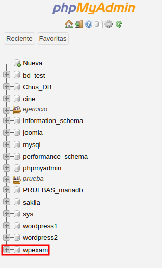
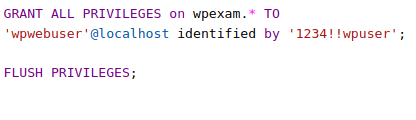
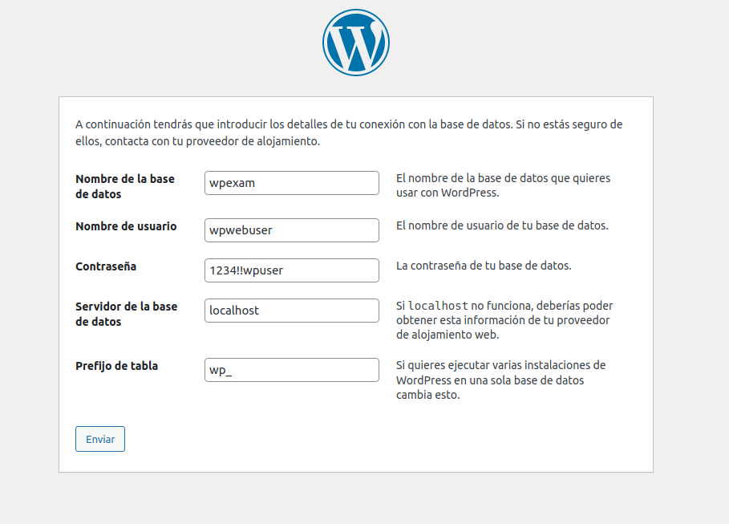
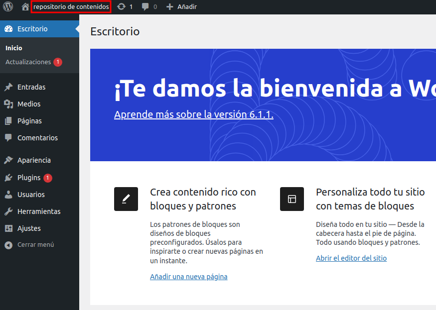
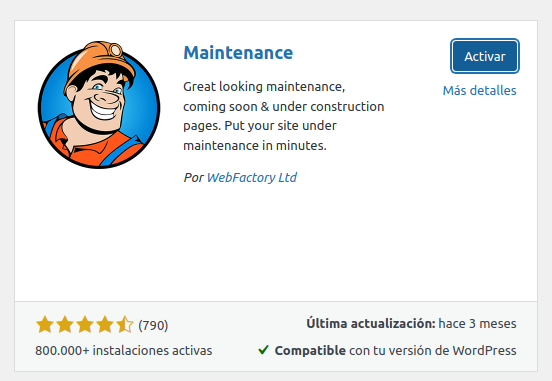
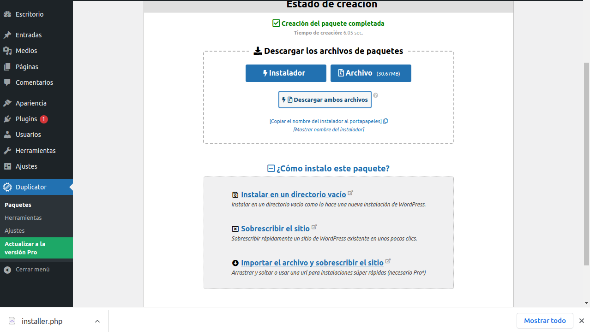
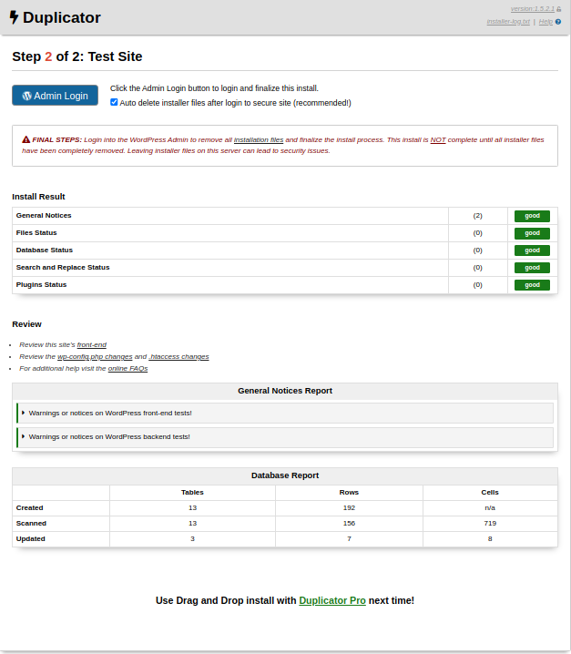
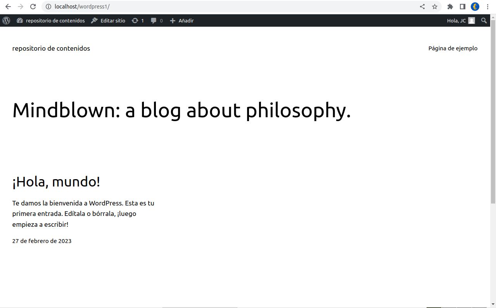

# Ejercicio del examen

### Crea una base de datos llamada wpexam




Se creó la base de datos a través de la interfaz gráfica


### configura el wpwebuser usuario para esta base de datos, contraseña: 1234!!wpuser




Se creó el usuario por comandos y se hizo un FLUSH.


### Instala wordpress


Descargar el paquete de Wordpress con:

```
wget https://es.wordpress.org/latest-es_ES.tar.gz
```


Descomprimir el archivo en la localización:

```
sudo tar xf latest-es_ES.tar.gz -C /var/www/html/
```


Modificar el propietario del directorio:

```
sudo chown -R www-data: /var/www/html/wordpress
```


Descargar una batería de extensiones de PHP

```
sudo apt install -y php-{curl,gd,imagick,intl,mbstring,xml,zip}
```

Y reiniciar Apache2

```
sudo systemctl reload apache2
```


Ahora que está instalado, se procede a la configuración del sitio incluyendo la conexión con la base de datos previamente creada y su usuario:





## Cambiando nombre del sitio a 'Repositorio de contenido'


Para ello se accede a ajustes > generales, el primer campo de texto.




## Se instala el plugin 'Maintenance':




## Se instala el plugin 'Duplicator' y se hace un backup:


'Crear Nuevo' y dejo la configuración por defecto. Al acabar el proceso, descargo los archivos:




## Se instala el backup en una nueva instancia de Wordpress:


Para ello se instala una nueva instancia de Wordpress, en este caso se le llamará a la carpeta wordpress1. Los archivos creados por el Duplicator son añadidos a la carpeta wordpress1.

Se entra en el enlace  de localhost/wordpress1, se clica en installer.php y se configuran las credenciales de la base de datos, usuario y usuario de base de datos.




Y ya se tiene el sitio duplicado:


